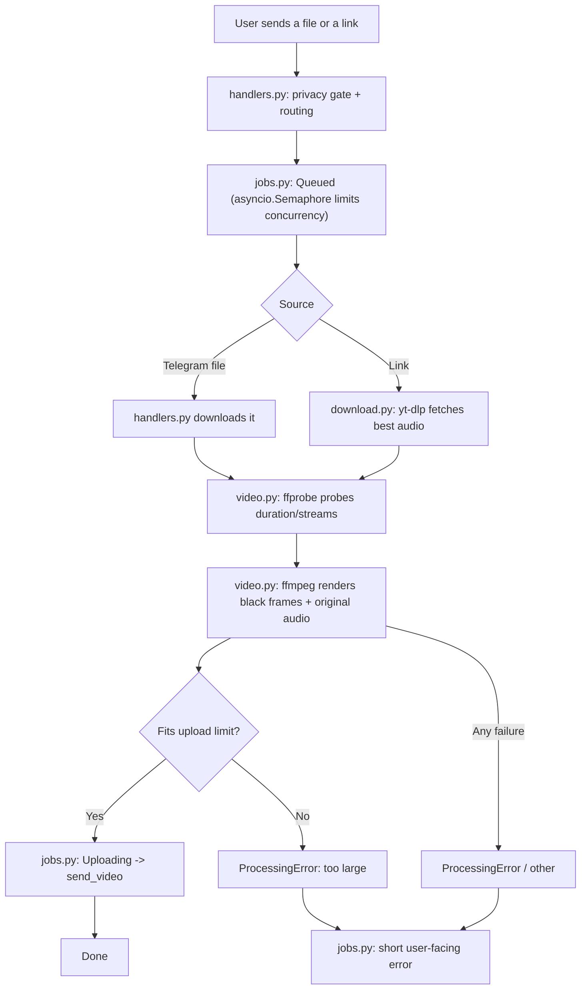

<p align="center">
  
</p>

# blackscreen-bot

A Telegram bot that turns video/audio files and social links into black-screen
videos (pure black frames with the original audio) — ready to upload anywhere
the original file would be too large or get flagged.

Send it a file or a link, get back a black-screen video with the same audio.

## Features

- Accepts **video, audio, voice, video-note, and document** uploads directly in chat
- Accepts links from **Facebook, Instagram, X (Twitter), YouTube, and TikTok** (yt-dlp powered)
- Live status updates: `Queued -> Downloading -> Converting -> Uploading`
- Runs **N conversions in parallel** (configurable), others wait in a queue
- Optional **privacy gate**: restrict the bot to your own Telegram user ID(s)
- Optional **login cookies** for sites that need authentication
- Configurable output size, max duration, and upload cap
- No database — everything is processed in a temp directory and deleted afterwards

## Requirements

- Python 3.10+ (developed and tested on 3.14)
- `ffmpeg` and `ffprobe` on your `PATH` (video/audio processing)
- A Telegram bot token from [@BotFather](https://t.me/BotFather)

```bash
# macOS
brew install ffmpeg

# Debian/Ubuntu
sudo apt install ffmpeg
```

## Installation

```bash
git clone <repo-url> blackscreen-bot
cd blackscreen-bot

python -m venv .venv
source .venv/bin/activate
pip install -r requirements.txt
```

## Configuration

Copy the example env file and edit it — the bot reads a `.env` file from the
project root on startup:

```bash
cp .env.example .env
```

| Variable               | Required | Default    | Description                                                                                                                                                             |
| ---------------------- | -------- | ---------- | ----------------------------------------------------------------------------------------------------------------------------------------------------------------------- |
| `BOT_TOKEN`            | yes      | —          | Bot token from [@BotFather](https://t.me/BotFather)                                                                                                                     |
| `ALLOWED_USER_IDS`     | no       | _(empty)_  | Comma-separated Telegram user IDs allowed to use the bot, e.g. `123456789,987654321`. **Empty = anyone can use the bot** (a warning is logged at startup)               |
| `BOT_API_URL`          | no       | _(cloud)_  | URL of a self-hosted [local Bot API server](https://core.telegram.org/bots/api#using-a-local-bot-api-server). When set, the upload cap becomes 2000 MB instead of 50 MB |
| `COOKIES_FILE`         | no       | —          | Path to a `cookies.txt` file passed to yt-dlp (login-gated links)                                                                                                       |
| `COOKIES_FROM_BROWSER` | no       | —          | Browser name to extract cookies from, e.g. `chrome`                                                                                                                     |
| `MAX_DURATION_MIN`     | no       | `90`       | Reject media longer than this many minutes                                                                                                                              |
| `MAX_PARALLEL_JOBS`    | no       | `2`        | How many conversions run at the same time                                                                                                                               |
| `BLACK_SIZE`           | no       | `1280x720` | Output resolution, format `WIDTHxHEIGHT`                                                                                                                                |

`.env` is listed in `.gitignore` — your token never gets committed.

## Usage

```bash
source .venv/bin/activate
python -m src
```

Expected startup output:

```
INFO ...: Bot started
INFO telegram.ext.Application: Application started
```

Then, in Telegram:

1. `/start` — see what the bot accepts
2. Send a **video/audio file**, or **paste a link**
3. Wait for the status messages; the finished black-screen video arrives in the
   same chat

## How it works



Errors are translated into short user-facing messages only in `jobs.py`;
core modules raise `ProcessingError` and stay Telegram-free.

## Project structure

```
src/
├── __main__.py    # entry point: python -m src
├── app.py         # wiring: Settings -> JobRunner -> handlers -> Application
├── config.py      # frozen Settings object; the only place that reads env vars
├── handlers.py     # /start, media handler, link handler, privacy gate
├── jobs.py        # queue, status flow, error -> user message mapping
├── download.py    # yt-dlp audio download (lazy import)
├── video.py       # ffprobe/ffmpeg: probe + black-video render
├── links.py       # link detection for FB / IG / X / YT / TikTok
├── models.py      # small data types (Link, MediaInfo, ...)
├── errors.py      # ProcessingError
└── __init__.py
```

Dependency rule: `config` / `errors` / `models` / `links` / `download` / `video`
never import `telegram`; leaf modules import nothing from the package; nothing
runs at import time (env is read only at startup).

## Notes

- The output file is the same duration as the source, with a black frame at the
  configured resolution — size shrinks to roughly the audio bitrate plus a
  tiny video overhead.
- Telegram caps uploads at **50 MB** through the cloud API, or **2000 MB** with
  a local Bot API server (`BOT_API_URL`). Oversized results are rejected with a
  clear error.
- Temporary files live under the system temp dir (`bsbot_*`) and are removed
  after each conversion.
